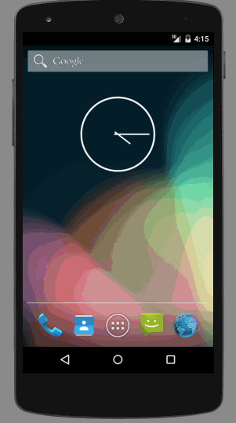

# TODO
Very simple to-do list app for Android. A preliminary project for a CodePath Android Bootcamp.

Time spent: 2 hours.

Completed user stories:
 * [x] Required: User can add and remove to-do items.
 * [x] Required: User can edit items.
 * [x] Required: Items persist, and are retrieved on app restart (from a saved text file).

 Walkthrough of all user stories:
 

